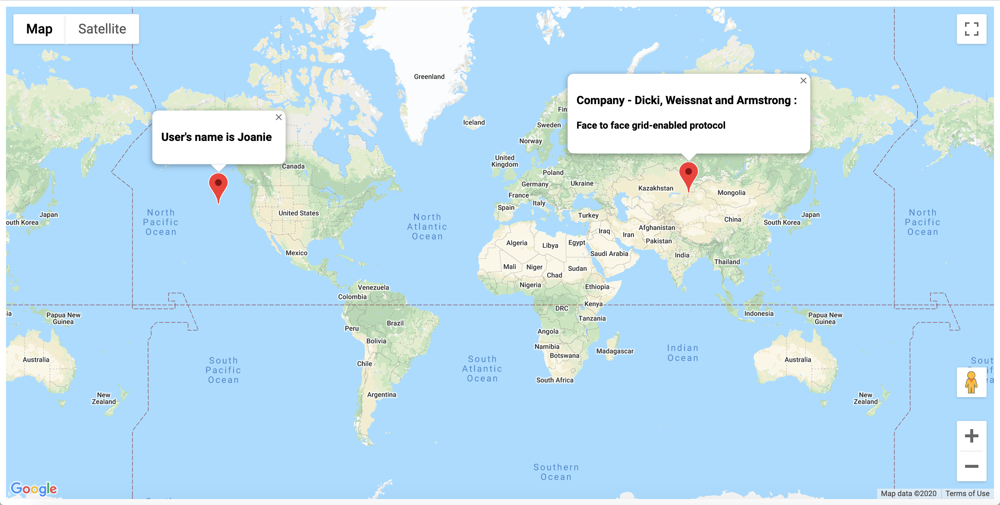

### TypeScript basics

#### in directory map-project small application displaying random location of an user and company.

##### google map integration/generating random data/ going through type definition files/using private modifiers/reusing code /restricting access with interface

